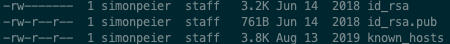

# Mac setup

## Install [Homebrew](https://brew.sh/)

Install homebrew via terminal with the following command:

```bash
/bin/bash -c "$(curl -fsSL https://raw.githubusercontent.com/Homebrew/install/master/install.sh)"
```

For infos about how to use it visit [docs.brew.sh](https://docs.brew.sh/)

To browse all available packages visit [formulae.brew.sh](https://formulae.brew.sh/)

## Install Applications

### Applications with brew

To install the applications via homebrew start the brew_installation.sh:

```bash
sh brew_installation.sh
```

This includes

- iTerm2
- Sublime Text
- Typora
- Insomnia
- Brave
- JetBrains Toolbox
- Spotify
- Dozer
- Rectangle
- Vlc player
- Notion
- Firefox
- Microsoft Word
- Microsoft Powerpoint
- Microsoft Excel

### Applications from App Store 

To install the applications from the AppStore visit the following links

- [CopyClip](https://apps.apple.com/de/app/copyclip-clipboard-history/id595191960?mt=12)

## Set up ZSH

Download Oh My Zsh with `sh -c "$(curl -fsSL https://raw.githubusercontent.com/ohmyzsh/ohmyzsh/master/tools/install.sh)"`

If you already used oh-my-zsh replace the .zshrc in the `~/` directory with the .zshrc file from your old computer

## Set up SSH

### Import existing keys

To import your old key pair, go to your users root directory and copy the .ssh/ directory to a drive

```bash
cp -a ~/.ssh /Volumes/<your-drive>
```

On your new device copy the directory to your users directory

```bash
cp /Volumes/<your-drive>/.ssh ~/
```

Make sure, that the file permissions are restricted:



If they are not change them with:

```bash
chmod 600 id_rsa
chmod 644 id_rsa.pub
chmod 644 known_hosts
```

### Create new keys

To generate a new pair of SSH keys you can use the following command. Before generating the pair, please check if this is the latest and most secure technology

```bash
ssh-keygen -t rsa -b 4096 -C <username>@simonpeier.net
```

